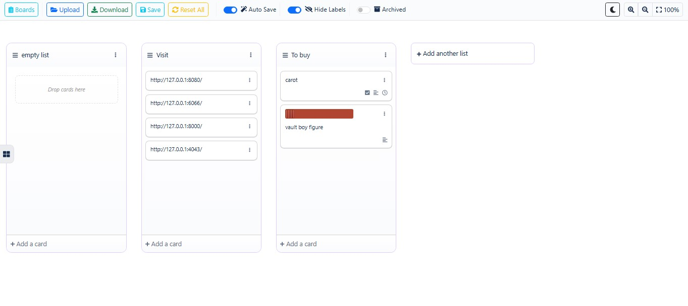

# TrelloOfflineViewer




Local-first, browser-only Trello board viewer/editor.

**Not implemented:** search/filter, comments, membership, cover images

**Extra:** markdown descriptions, tags

[Online Demo](https://trello.smohammadabedy.ir/)
/[github page](https://smohamadabedy.github.io/offlineTrelloViewer/)


---

```sh
npm install
npm run dev
npm run build
```

or simply run:
```
 docs/index.html
